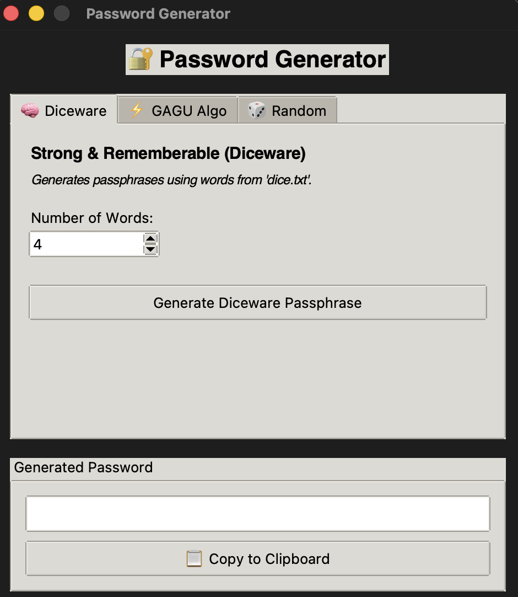
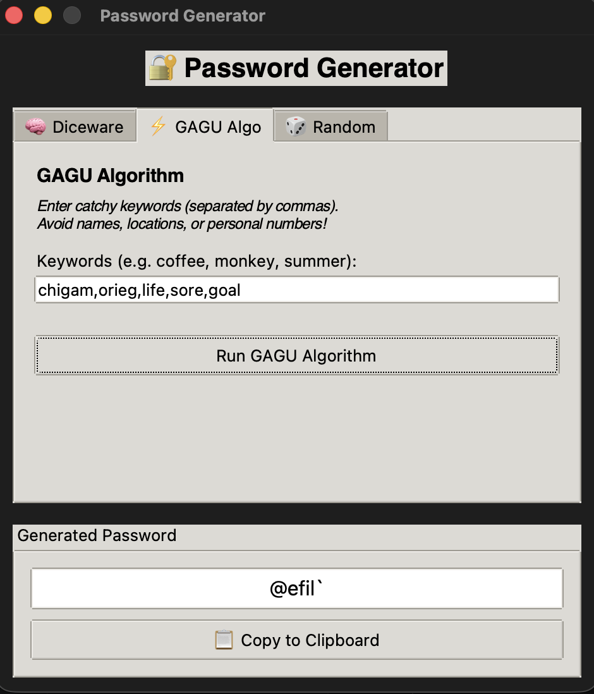
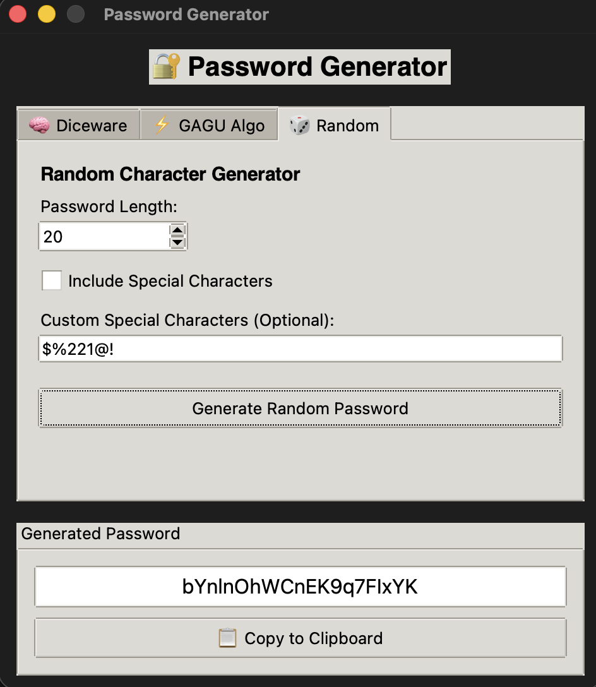

# Password Generator

A lightweight, local password generation application built with Python and Tkinter. It offers three distinct generation strategies ranging from memorable passphrases to cryptographically secure random character strings, operating entirely offline without AI or external web APIs.

---

## Interface

| Diceware Passphrases | GAGU Algorithm | Secure Random |
| :---: | :---: | :---: |
|  |  |  |

---

## Key Features

- **Diceware Generation**: Produces memorable, multi-word passphrases by mapping cryptographically generated 5-digit rolls against a local dictionary (`dice.txt`).
- **GAGU Algorithm**: A custom string-manipulation pipeline that obfuscates user-provided keywords through reversal, token skipping, and special-character substitution.
- **Cryptographic Random Generator**: Uses Python's native `secrets` module to generate high-entropy character strings with configurable lengths and customizable special-character sets.
- **Clipboard Integration**: One-click copying to transfer generated credentials directly to your clipboard.

---

## Generation Methods

### 1. Diceware Strategy
Generates passphrases designed for human memorability without sacrificing security. The algorithm selects words from `dice.txt` using entropy derived from the standard 5-dice roll lookup method.

### 2. GAGU Algorithm
Designed to convert non-sensitive user keywords into unpredictable strings. The processing loop evaluates each token and randomly applies one of three operations:
- **Reverse**: Inverts the character sequence of the keyword.
- **Skip**: Omits the keyword token completely.
- **Substitute**: Replaces the word with a randomly chosen special character.

### 3. Random Character Generator
Generates pure random passwords suitable for strict password requirements. Users can set custom lengths (up to 64 characters) and specify custom sets of symbols.

---

## Installation & Running

### Requirements
- Python 3.10 or higher
- Tkinter library support (`python-tk`)

### Quick Start

1. **Clone the repository:**
   ```bash
   git clone [https://github.com/gagankishoreint-glitch/PassGen.git](https://github.com/gagankishoreint-glitch/PassGen.git)
   cd PassGen-
